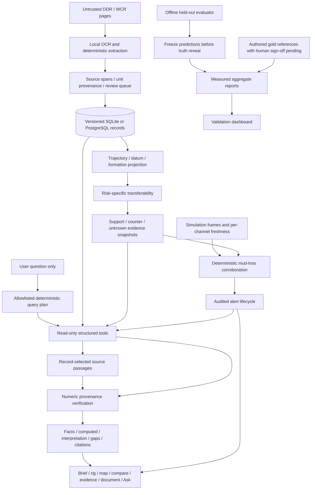

# NWIS prototype architecture

Documents have no tool execution path. Hidden labels belong to offline evaluation; no runtime route serves the truth files. Live signals are replay/manual simulation channels. There is no rig actuation edge. The offline package serves API and prebuilt React assets from one loopback origin with a separate demo database.
